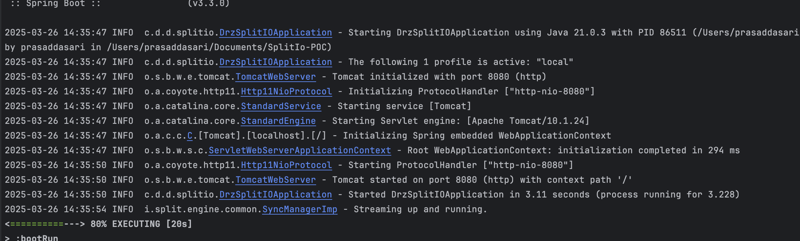
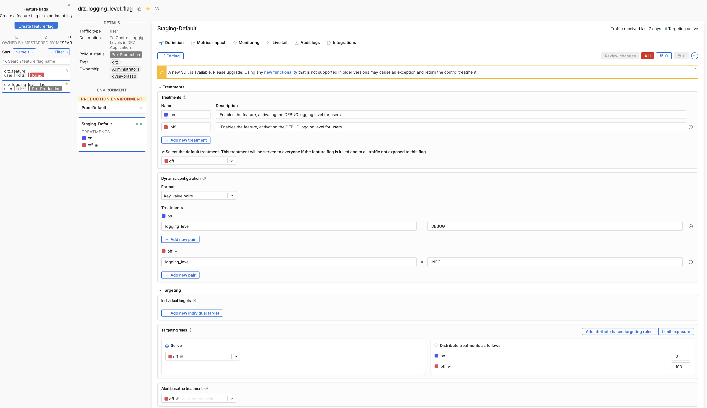
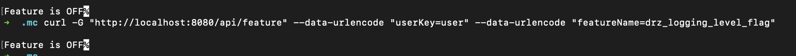
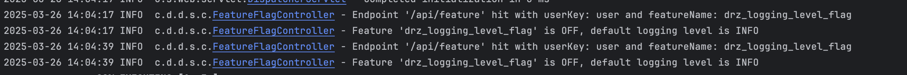
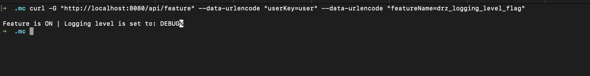
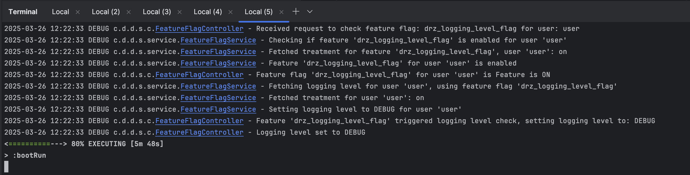
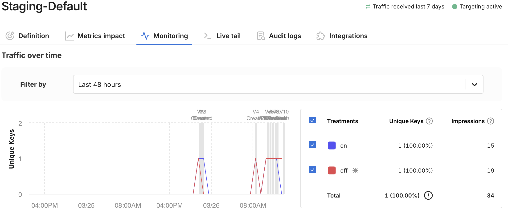

# SplitIo-POC

## Overview
This POC application demonstrates how to use Split.io to manage Feature Flags in a Java application. The goal is to understand the Split.io framework's functionality for Feature Flags, allowing us to add new functionality for a limited scope of requests or enable/disable certain features without redeploying the cluster.

## Use Case
For example, we can temporarily switch the application's logging level from INFO to DEBUG when debugging some issues.

## Technology Stack
- Java
- Spring Boot
- Gradle
- Split.io Java SDK

## Package
- `com.digicert.drz.splitio.poc`

## Reference Link
[Split.io Java SDK Documentation](https://help.split.io/hc/en-us/articles/360020405151-Java-SDK)

## Setup Instructions

1. **Clone the repository:**
   ```bash
   git clone https://github.com/prasadDasari/SplitIo-POC.git
   cd SplitIo-POC
   2. **Build the application:**
   ./gradlew clean build  // To build the application with no compilation errors etc

   3. **Run the application:** 
   ./gradlew bootRun --args='--spring.profiles.active=local' // To run the application locally




##### Necessary Files as a part of Implementation
To integrate Split.io into the project, add the following files:

**SplitConfig.java**
This file contains the configuration for Split.io.
**FeatureFlagService.java**
This file contains the service to interact with Split.io feature flags.
**FeatureFlagController.java**
This file contains the controller to expose an API endpoint for checking feature flags.
**application-local.yaml**
This file is a configuration file used in Spring Boot applications to define environment-specific properties.
It includes settings such as the application name, active profile, server port, and the Split.io API key.


2 **Configure Split.io:**
   Log in to your Split.io account, after successful Registration.
   Navigate to the "API Keys" section in the Split.io dashboard.
   Generate and copy the API key for your environment.
   Update the application-local.yaml file with your Split.io API key.

3 **Usage**
Use Split.io to create and manage feature flags.
Modify the application to check the status of feature flags and enable/disable features accordingly.


### Testing Feature Flags after creating them in Split.io
1. Create a feature flag in Split.io. Ex: `drz_logging_level_flag` created for this poc.
2. Configure Treatments and necessary config for logging level, as per screenshot, Click `Review` Changes and Click `Save` it




3. Run the spring boot DrzSplitIOApplication.
4. Access the API endpoint to check the status of the feature flag: (Ex: http://localhost:8080/feature-flag/{feature-flag-name})
   Check `Curl Endpoints` provided below
5. Verify that the feature flag is working as expected
6. Modify the feature flag in Split.io to see the changes reflected in the application.
7. Test the application again to verify that the feature flag changes are working as expected.

### Curl Endpoints
Please Note: Default logging level is INFO.
curl -G "http://localhost:8080/api/feature" --data-urlencode "userKey=user" --data-urlencode "featureName=drz_logging_level_flag"




-->Response:  "Feature is OFF%" for Info Level

## Service Logs to check for INFO Logs


8. Switch the feature flag to ON in Split.io and test the application again to see the logging level change to DEBUG.
## curl -G "http://localhost:8080/api/feature" --data-urlencode "userKey=user" --data-urlencode "featureName=drz_logging_level_flag"



-->  Response "Feature is ON%" For Debug Level

If the feature flag is ON, the logging level will be changed to DEBUG

## ## Service Logs to check for DEBUG Logs


## Monitoring ON/OFF Flag : Metrics from Split.io


### Conclusion
Split.io is a powerful tool for managing feature flags in applications. It allows developers to control the behavior of their applications without redeploying the codebase. 
By integrating Split.io into the project, developers can easily create, manage and test feature flags to enable/disable features based on specific conditions. 
This POC application demonstrates how to use Split.io to manage feature flags in a Java application and provides a starting point for integrating Split.io into other projects.

###
Alert Baseline Treatment to ensure INFO logging is the default when the flag is killed,
while the Default Treatment would help set the logging level for users 
who aren't specifically targeted by the flag.
